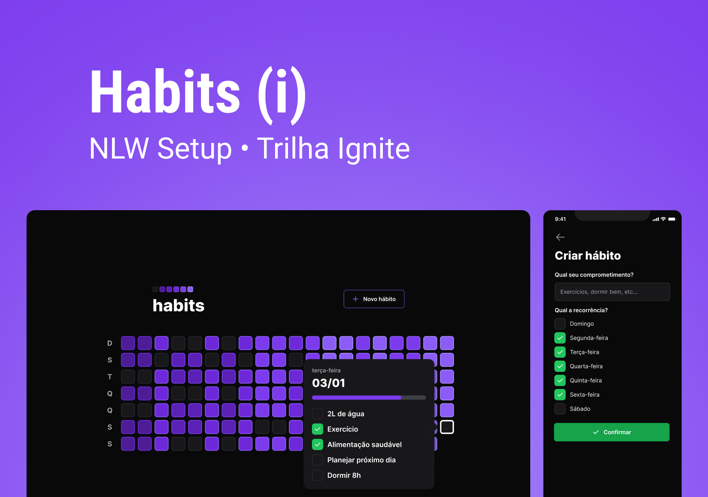

<!-- markdownlint-disable MD033 -->
<!-- markdownlint-disable MD041 -->

<div align="center">
   
</div>
<br>

<div align="center">
   <a href="https://github.com/mgckaled">
      
   </a>
   
   
   <a href="https://github.com/mgckaled/nlw-ignite-setup/commits/main">
      
   </a>
  
</div>

<br>

<div align="center">
  <a>
     
     
     
     
     
     
     
     
    
  <a/>
</div>

<br>

# NLW SETUP

<div align="center">

[**Sobre o Projeto**](#sobre-o-projeto) &nbsp;&nbsp;**•**&nbsp;&nbsp;
[**Tecnologias**](#tecnologias) &nbsp;&nbsp;**•**&nbsp;&nbsp;
[**Layout**](#layout) &nbsp;&nbsp;**•**&nbsp;&nbsp;
[**Configurações**](#configurações) &nbsp;&nbsp;**•**&nbsp;&nbsp;
[**Licença**](#licença)&nbsp;&nbsp;**•**&nbsp;&nbsp;
[**Autor**](#autor)

</div>

## Sobre o Projeto


<br>

**_NLW SETUP_** é o projeto desenvolvido durante a trilha Ignite da **Next Level Week**, um evento online produzido pela [**Rocketseat**](https://github.com/Rocketseat).

## Tecnologias

<table>
  <tbody>
    <tr>
      <td style="font-weight: bold">Back-end</td>
      <td>
        <a href="https://nodejs.org/en/" target="_blank" rel="noopener noreferrer">NodeJs</a>,
        <a href="https://www.typescriptlang.org/" target="_blank" rel="noopener noreferrer">Typescript</a>,
        <a href="https://www.prisma.io/" target="_blank" rel="noopener noreferrer">Prisma</a>,
        <a href="https://www.fastify.io/" target="_blank" rel="noopener noreferrer">Fastify</a>,
        <a href="https://www.sqlite.org/index.html" target="_blank" rel="noopener noreferrer">SQLite</a>
      </td>
    </tr>
    <tr>
      <td style="font-weight: bold">Front-end (web)</td>
      <td>
        <a href="https://reactjs.org/" target="_blank" rel="noopener noreferrer">React</a>,
        <a href="https://www.typescriptlang.org/" target="_blank" rel="noopener noreferrer">TypeScript</a>,
        <a href="https://tailwindcss.com/" target="_blank" rel="noopener noreferrer">TailwindCSS</a>
      </td>
    </tr>
    <tr>
      <td style="font-weight: bold">Mobile</td>
      <td>
        <a href="https://reactnative.dev/" target="_blank" rel="noopener noreferrer">React Native</a>,
        <a href="https://expo.dev/" target="_blank" rel="noopener noreferrer">Expo</a>
      </td>
    </tr>
  </tbody>
</table>

## Layout

O layout das telas da aplicação **_NLW SETUP_** foi desenvolvido pela equipe da **Rocketseat** através da ferramenta [**Figma**](https://www.figma.com).
Você pode acessar o layout através deste link: [**Habits**](https://www.figma.com/file/JlYQcvtGp2CYTfvzHhTTMe).

## Configurações

### **Requisitos**

Necessário realizar as instalações:

- [Git](https://git-scm.com/)
- [npm](https://www.npmjs.com/)
- [Node](https://nodejs.org/)
- [Expo](https://docs.expo.dev/)
- [Expo Go](https://expo.dev/client)

Criar conta e configurar os serviços externos:

- [GitHub](https://github.com/)
- [Expo](https://expo.dev/)

Clonar reposítório:

```bash
# Execute o comando git clone para realizar o clone do repositório
$ git clone https://github.com/mgkclaed/nlw-ignite-setup.git
# ou execute
$ gh repo clone mgckaled/nlw-ignite-setup
# Entre na pasta do repositório clonado
$ cd nlw-ignite-setup
```

### `/server`

```bash
# criar projeto /server
$ npm init -y
# instalar dependências
$ npm install
# criar arquivo tsconfig.json
$ npx tsc --init
# setup prisma com flag SQLite - schema prisma file / .env
$ npx prisma init --datasource-provider SQLite
# migration - mecanismo de versionamento de banco de dados (arquivos de instruções)
$ npx prisma migrate dev
# visualisar banco de dados - Prisma Studio
$ npx prisma studio
# Gerar ERD - Diagrama de Banco de Dados
$ npx prisma generate
# Gerar seed (exemplo) para Banco de Dados. Observar configurações do prisma no package.json
$ npx prisma db seed
```

### `/web`

```bash
# criar projeto /web
$
## instalar dependências
$ npm install
```

### `/mobile`

```bash
# criar projeto /mobile
$
## instalar dependências
$ npm install
# inicializar expo
$ npx expo start
```

```bash
# após criar uma conta no Expo, faça login pelo terminal:
$ npx expo login
# confirme seu nome e senha
# confirmar login. O terminal deverá mostrar o nome do usuário
$ npx expo whoami
```

## Licença

Distribuído sob a licença **_MIT_**. Veja [LICENSE](LICENSE) para mais informações.

## Autor

Feito por Marcel Kaled. Entre em contato!

---

<h5 align="center">
  &copy;2023 - <a href="https://github.com/mgckaled/">Marcel Kaled</a>
</h5>
